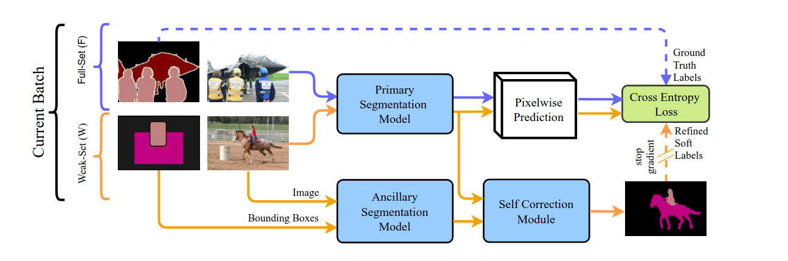
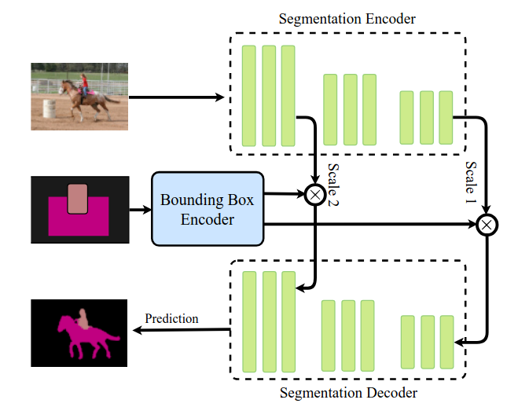

  

<h1 align="center"> Semi-Supervised Semantic Image Segmentation with Self-correcting Networks </h1>

  A pytorch implementation of the <strong>CVPR 2020 paper</strong>, <a href="https://openaccess.thecvf.com/content_CVPR_2020/papers/Ibrahim_Semi-Supervised_Semantic_Image_Segmentation_With_Self-Correcting_Networks_CVPR_2020_paper.pdf"><em>Semi-Supervised Semantic Image Segmentation with Self-correcting Networks</em></a> by <strong>Ibrahim et al.</strong>
  This framework enables joint learning from a small fully supervised dataset and large weakly labeled data, using self-correcting networks to refine predictions and reduce annotation noise 

## Table of Content
1. [Stage 1: Ancillary Model Training](#stage-1-ancillary-model-training)
    - [Model Architecture](#model-architecture)
    - [Loss Function](#loss-function)
    - [Hyperparameters](#hyperparameteres)
    - [Training Setup](#training-setup)
    - [Training Dataset](#training-dataset)
2. [Stage 2](#stage-2)

<strong>The approach in the paper divides training into three stages: the first trains the ancillary model, the second trains the self-correcting network, and the third focuses on the primary model.</strong>

## Stage 1 Ancillary Model Training

  

Stage 1 trains the ancillary model to learn robust representations from weakly labeled examples.

### Model Architecture
the model is built on standard encoder-decoder segmentation models (DeepLabV3+ is used in my implementation), the paper is extending the architecture with additional bounding box input.

1. Image Encoder:
The input image is processed by a pretrained conv encoder (Resnet101 is used in my implementation). it produces 2 scale feature maps (low and high feature maps).

2. Bounding Box Encoder:
This encoder takes the weak labeled mask to encode box information into spatial attention map.

The input weak mask is resized (using 3x3 Conv followed by sigmoid activation) to match the spatial resolution of low and high feature map.

3. Feature Attention Fusion:
In this step the output of bounding box encoder (box low and high) are fused with the low and high attention map from Image encoder using <strong>Element wise multiplication </strong>.

4. Decoder:
Same as Deeplabv3+ decoder the decoder is expecting multi scale feature maps.
Both fused low and high scales are passed to decoder 
low is passed to internal layer of the decoder and
high is passed to the begining of the decoder.

### Loss Function
The model is learning conditional probability distribution over input image (x) and weak labeled mask (b)

Panc(y | x, b)

The loss function is normal <strong>Cross Entropy</strong>

L = -log Panc(y | x, b)

### Hyperparameters
|Parameter|Value|
|---|---|
|Learning rate|7e-3|
|Scheduler|custom: batch based scheduler|
|Optimizer|AdamW|
|Gradient Accumulation|2 batches|
|Epochs|650|
